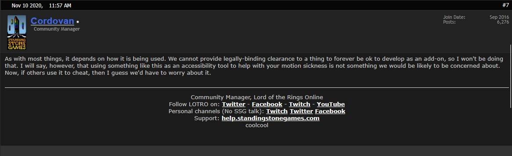
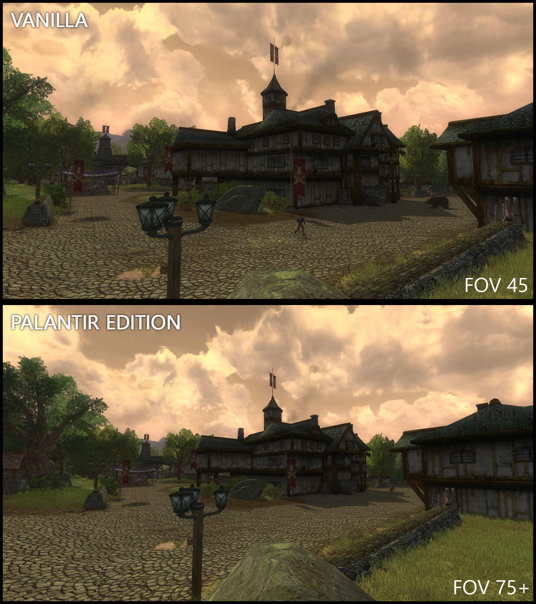
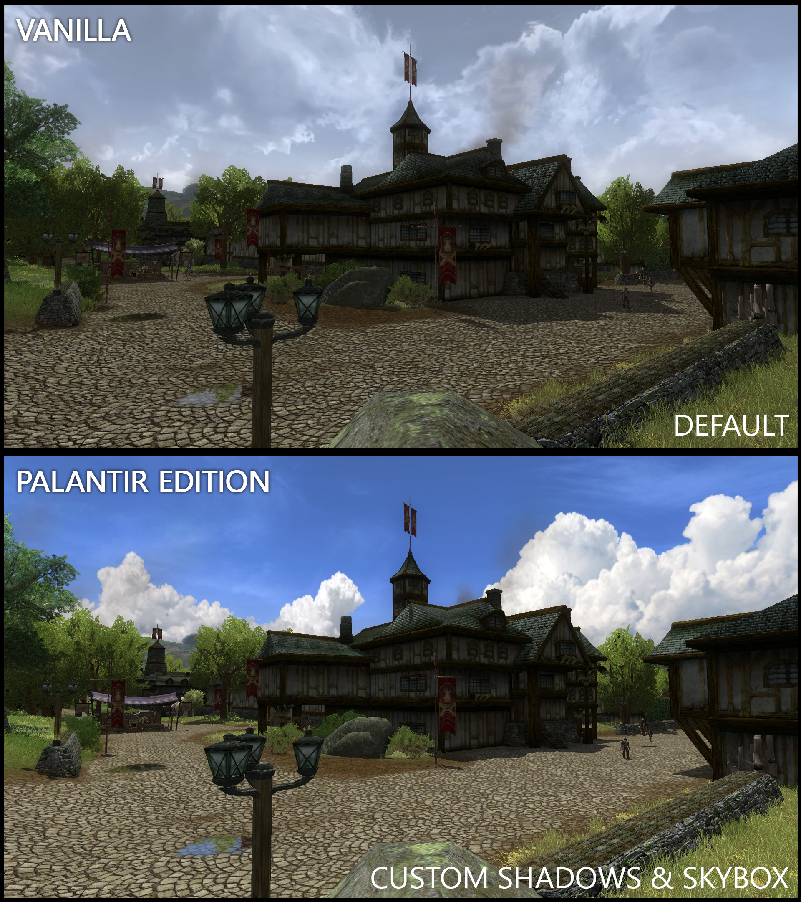

    
    
    
    

# Lord of the Rings Online - Palantir Edition

This project contains the binaries for Lord of the Rings Online - Palantir Edition. This project aims to extend the game with - for other players - non-interfering features, that are still missing from the game options.

## Important Note
**Use this software at your own risk**. The binaries are altering the game's code in the PC's memory and therefore might be identified as a hack or virus. If you use an anti-virus software it might quarantine the files. This is a false positive because the code injection is intended behavior and does not cause any harm. 
As the community manager stated in his response on the old forums, `Standing Stone Games` is not taking action against third-party tools that enhance the experience of players in-game as long as it's not granting an unfair advantage over other players. Yet, Standing Stone Games might change their position in the future, regarding this topic and thus might ban suspected accounts on this matter. **However**, we're not granting any such advantage and we're using those tools ourselves for nearly a decade now - not affecting the gameplay or harming others, it's to be considered safe. 
That said, we're hoping you enjoy this project as much as we do and that it's adding to your experience in-game.

    
    

        This was the original response by Cordovan on the old forums. 
        It can be found on 
        <a href="https://web.archive.org/web/20250613211135/https://forums-old.lotro.com/forums/showthread.php?684404-motion-sickness-FOV-and-a-question-for-SSG&p=8045778#post8045778" target="_blank" style="color: #666; text-decoration: underline;">
            archive.org
        </a>
    

## Usage
### Do this once

1. In the LOTRO Launcher by SSG go to Options
2. Change the game client to 64-bit
3. Download the current release from [here](https://github.com/PalantirTools/palantir_mirror/releases)
4. Extract the bin.zip archive to wherever you like
5. In the graphics settings of LOTRO, set the 'graphics hardware level' to DirectX11

### Do this every time you want to use the tools

1. Start the game as usual
2. Go to deskop (e.g. press ALT+TAB)
3. Go to the location where you extracted the bin.zip archive
4. Start the `palantir.launcher.exe` that is part of this project in ADMIN mode

## Keybindings
Please unbind all actions from the Numpad on your keyboard as this project uses these keys for its own actions.

* **F1** Reverts all changes and unloads the program
* **F2** Activates the custom GUI setting

## Related Projects

* [Lotro-FOV by Mklink](https://github.com/mklinik/lotro-fov) provides a manual on how to alter the FOV, to help players with motion sickness.
* [MouseTracks by huntfx](https://github.com/huntfx/MouseTracks/) captures mouse input over a period of time for display in statistical graphics.
* [OneLauncher by JuneStepp](https://github.com/JuneStepp/OneLauncher) provides a custom launcher for Lotro with advanced features.
* [MMOAction by ils94](https://github.com/ils94/MMOAction) provides an action camera for common MMOs written in Python.
* [LotroCompanion](https://github.com/LotroCompanion/lotro-companion) shows LotRO account and character data and various lore info.

## Comparison Gallery

